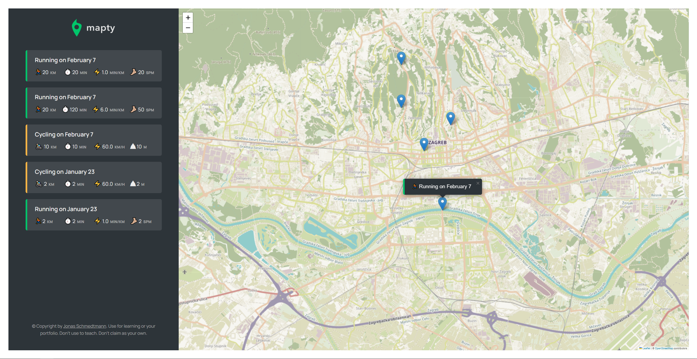

# Mapty

Mapty is a fitness activity tracking application that allows users to record and track their outdoor activities such as running, cycling, walking, and more.

## About the Project

Mapty is part of the "The Complete JavaScript Course 2024: From Zero to Expert!" course created by Jonas Schmedtmann. The purpose of this project is to demonstrate practical applications of JavaScript, including DOM manipulation, working with local storage for data persistence, accessing geolocation data using web APIs, and more. Some key features of the project include:

- Tracking various types of fitness activities on a map interface
- Recording activity details such as distance, duration, and location
- Storing activity data locally using the browser's localStorage API
- Displaying activity statistics and summaries

## How to Run the Project

1. Download or clone this repository to your computer.
2. Open the `index.html` file in your web browser.

## Live Demo

Check out the live demo of the project on Netlify: [Mapty Demo](https://mapty-trpimir.netlify.app/).

## Author

This project is part of the "The Complete JavaScript Course 2024: From Zero to Expert!" course created by Jonas Schmedtmann.

## License

This project is available under the MIT license. For more information, see the `LICENSE` file.
